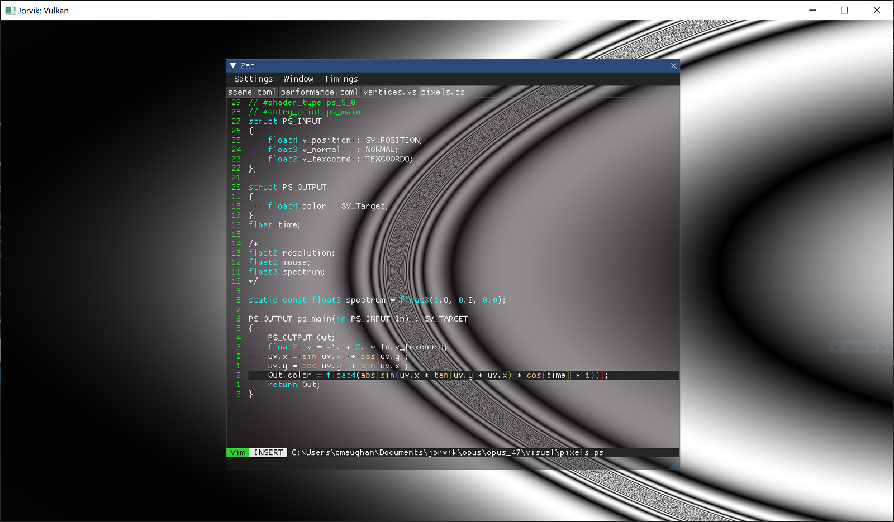
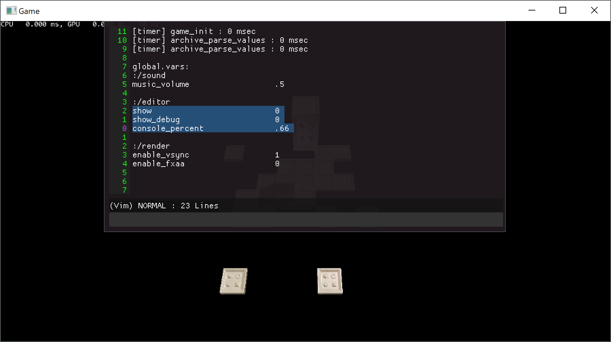

[Zep](https://github.com/cmaughan/zep) - A Mini Editor
===================================================================================================

[](https://travis-ci.org/cmaughan/zep)
[](https://ci.appveyor.com/project/cmaughan/zep)
[](https://codecov.io/gh/cmaughan/zep)
[](https://github.com/cmaughan/zep/blob/master/LICENSE) 

(NOTE: Due to a big merge, the automated builds are currently being repaired.  The core library is still dependency free, but the demo application needs the MUtils library to be built first.
This should be fixed by early next week.)

Zep is a simple embeddable editor, with a rendering agnostic design and optional Vim mode.  It can optionally be included using a single header; and the core library is dependency-free (the demo application requires an installed package).  Out of the box Zep can draw to a Qt Widget or an an ImGui window - useful for embedding in a game engine.  A simple syntax highlighting engine is provided,
and can easily be extended. Basic theming support is included, and window tabs and vertical/horizontal splits are also available.  Zep is 'opinionated'
in how it does things, but is easy to modify and supports many common features.  It is heavliy influenced by Vim, but has a good notepad-style editing mode too.


Zep supports the standard editing keystrokes you'll find in most editors, along with a reasonable subset of modal Vim editing as an option.
The demo project lets you switch between the editing modes on the fly.
Zep is not meant to replace Vim.  I don't have a lifetime spare to write that, but it has most of the functionality I use day to day, and 
anything missing will be added over time.

Zep is ideally suited to embedding in a game engine, as an in-game editor, or anywhere you need a simple editor without a massive dependency 
on something more substantial like NeoVim.  The core library is dependency free, small, and requires only a modern C++ compiler.  Zep can 
be included in your project by setting a define and including zep.h, or building a dependency free library.
The demos for Qt and ImGui require their additional packages, but the core zep code is easily built and cross platform.  The ImGui demo builds
and runs on Windows, Linux and Mac OS.  If you're a Vim user, you might often suffer the frustration of not being able to use Vim keystrokes
in your tools.  Zep solves that.

Key Features:
* Modal 'vim' or modeless 'standard' editing styles.
* Qt or ImGui rendering (and extensible) 
* Terminal-style text wrapping
* Splits and tabs
* A simple syntax highlighting engine, with pluggable secondary highlighters
* Theme support
* Text Markers for highlighing errors, etc.
* No dependencies, cross platform, small library
* Single header compile
* Builds on VC 2017, GCC 6, Clang. C++14 is the basic requirement

Limitations:
* Zep currently ignores tabs and converts them to spaces, and internally works with \n. It will restore \r\n on save if necessary.
* Utf8 is not supported, and may not be, though the code has some placeholders for it as a future possibility
* Vim mode is limited to common operations

Though I have limited time to work on Zep, I do try to move it forward at York Developer's regular Code and Coffee sessions. Zep was my 2018 project
but has already proved quite popular, and I try to throw more features in when I can.
There are over 150 unit tests for the editing modes.  This project started mainly as an experiment
and a learning exercise.  I like the idea of a programmer building programmer tools for their own use, just as carpenters used to build their toolbox.

Pull requests are appreciated and encouraged ;) 

There also is a trivial example of integrating zep into imgui here:
[Zep Inside ImGui Demo](https://github.com/cmaughan/imgui)

Screenshots
-----------
Using the ImGui Renderer:


Using the Qt Renderer:


A light theme:


Embedded in a Live Coding tool:


Embedded in a Game Engine:


# Design
## Layers
Zep is built from simple interacting layers for simplicity.

### Text
The text layer manages manipulation of text in a single buffer.  At the bottom level, a gap buffer struture maintains the text information.
The buffer layer is responsible for saving and loading text, and supporting simple search and navigation within the text.  Much of the higher
level mode code uses the buffer commands to move around inside the text.

A command layer supplies functions to add and remove text, and supports undo; all buffer modifications are done with these simple commands.

The Mode layer supports editing text using Vim commands, or using standard notepad-like commands. 

A Syntax layer monitors the buffer and provides file-specific syntax coloring. Syntax highlighting can be easily extended

### Display
Tab windows are like workspaces, each containing a set of windows arranged in splits.  The window lass arranges the rendering and calls a thin
display layer to draw the text.  This makes it simple to draw the editor using different rendering code.  Adding Qt took just an hour to do.

### Vim & Standard Modes
Mode plugins provide the editing facility - currently that is Vim & Standard.
The Vim mode has most of the usual word motions, visual mode, etc.  The standard mode has the usual shift, select, cut/copy/paste, etc.
See [Vim Mode](https://github.com/cmaughan/zep/wiki/Vim-Mode), or the top of the mode_vim.cpp file for a list of supported operations in Vim

# Building
You can follow the build buttons above to see build scripts, but the process is fairly simple.
There is also a sister project, [Zep Inside ImGui Demo](https://github.com/cmaughan/imgui), which shows how simple it is to add Zep to the standard ImGui demo

## Install Packages  
If you don't have them already, the following packages are required, depending on your system.  Note, that SDL is part of the build,
and not installed seperately.  It is only used for the demo, not the core editor library or unit tests. Qt is required to build the Qt demo on linux.
If you have compilation problems, you might need to investigate the compiler you are using.
Ubuntu 16 & 17 both have a recent enough version for it to work.  On Ubuntu 14 I tend to upgrade to g++6
The Qt app builds on linux, but is not part of the travis setup yet.

## Single Header
To start using zep in your project straight away, you can use the single header option.  Add the following to one of your source files:
```
#define ZEP_SINGLE_HEADER_BUILD
#include <zep/src/zep.h>
```
This effectively compiles all of the zep code in a single step. Put it in a file you don't modify often, since it will increase the compile time for that file.

## Linux
```
sudo apt install cmake  
sudo apt install git  
sudo apt install qt-default (for Qt support)
```

## Mac
```
brew install cmake
brew install git
```
(If in doubt, see the .travis.yml build file for how the remote build machines are setup)

## Get the Source
git clone https://github.com/cmaughan/zep zep  
cd zep  

## Make
There are some sample scripts which call CMake, but you can generate makefiles for your favourite compiler by passing a different generator to it.

## Linux 
```
./config.sh
make
```  

## Mac (XCode)
```
./config_mac.sh
cd build
cmake --build .
```
## PC
For ImGui:
```
config.bat
```
For Qt:
``` 
set QT_INSTALL_LOCATION=C:\Qt\5.10.0\msvc2017_64 (for example)
config_all.bat
```
For Both:
``` 
cd build
cmake --build .
(Or load solution in VC 2017)
```

## Tests
Type `CTest --verbose` in the build folder to run unit tests.

Libraries
-----------
This sample uses SDL for the window setup, and ImGui for the rendering, or Qt.

[SDL2: Media/Window Layer](https://www.libsdl.org/download-2.0.php)  
SDL2 is used to get a window on the screen in a cross platform way, and for OpenGL to generate a Context.

[ImGui: 2D GUI](https://github.com/ocornut/imgui)  
ImGui is a great 2D User interface for 3D applications

